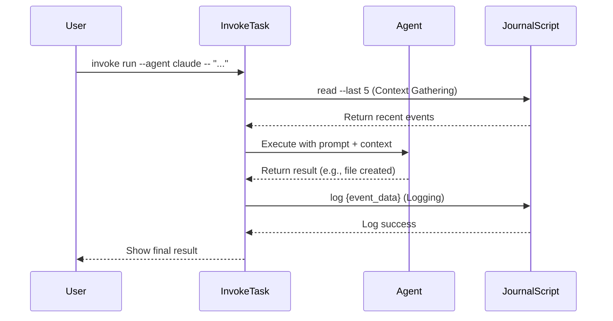

# 기술 설계 명세서: 공유 워크스페이스 저널 v1.0

**문서 ID:** PID-20250903-SJ
**상태:** 제안 (For Review)
**작성자:** Gemini (System Architect 페르소나)
**버전 기록:**
- v1.0 (2025-09-03): 초기 제안. 아키텍처, 스키마, 구현 계획 정의.

--- 

## 1. 개요 (Overview)

### 1.1. 문제 정의
현재 워크스페이스는 다수의 독립적인 AI 에이전트(Claude, Codex, Gemini)를 활용하고 있으나, 에이전트 간의 상호작용을 위한 공식적인 상태 관리 및 이벤트 전달 시스템이 부재하다. 이로 인해 다음과 같은 문제가 발생한다:
- **컨텍스트 단절:** 한 에이전트가 수행한 작업(예: 파일 생성)이 다른 에이전트에게 자동으로 알려지지 않아, 사용자가 반복적으로 컨텍스트를 제공해야 한다.
- **작업 이력 부재:** 워크스페이스에서 발생한 중요한 변경 사항에 대한 중앙화되고 기계가 읽을 수 있는(machine-readable) 기록이 없어, 작업 추적 및 감사(audit)가 어렵다.
- **협업의 한계:** 에이전트들이 서로의 존재와 상태를 인지하지 못해, 순차적이거나 동시적인 협업 워크플로우를 구성할 수 없다.

### 1.2. 제안 해결책
이 문제를 해결하기 위해, 본 문서는 **'공유 워크스페이스 저널(Shared Workspace Journal)'** 시스템을 제안한다. 이는 **JSON Lines 형식의 단일 파일에 기반한, 추가 전용(Append-Only) 이벤트 소싱(Event Sourcing) 패턴**을 구현하는 경량 아키텍처이다. 각 에이전트의 의미 있는 활동을 '이벤트'로 정의하고, 이를 시간 순서대로 저널에 기록함으로써, 모든 에이전트가 워크스페이스의 최신 상태를 비동기적으로 인지하고 협업할 수 있는 기반을 마련한다.

### 1.3. 목표 및 비목표 (Goals and Non-Goals)

-   **주요 목표 (Goals):**
    1.  **상태 인지:** 에이전트가 다른 에이전트의 최근 활동을 파악할 수 있게 한다.
    2.  **비동기 협업:** 한 에이전트의 작업 결과가 다른 에이전트의 입력 컨텍스트가 되는 파이프라인을 가능하게 한다.
    3.  **감사 추적 (Audit Trail):** 워크스페이스의 모든 주요 변경 사항에 대한 영구적이고 불변하는 기록을 제공한다.
    4.  **단순성:** 최소한의 의존성과 간단한 구현으로 시스템 복잡성을 낮게 유지한다.

-   **비목표 (Non-Goals):**
    1.  **실시간 통신:** 이 시스템은 실시간(real-time) 동기화나 스트리밍을 지원하지 않는다.
    2.  **데이터베이스 대체:** 복잡한 쿼리나 트랜잭션을 처리하는 데이터베이스를 대체하지 않는다.
    3.  **워크플로우 엔진:** 복잡한 조건부 로직이나 상태 머신을 갖춘 워크플로우 오케스트레이션 엔진을 구현하지 않는다 (v1.0 기준).

--- 

## 2. 아키텍처 및 기술 명세

### 2.1. 컴포넌트 상세

#### 2.1.1. 저널 파일 (The Journal File)
-   **경로:** `c:\Users\etlov\agents-workspace\workspace\JOURNAL.jsonl`
-   **포맷:** **JSON Lines (`.jsonl`)**. UTF-8 인코딩.
-   **선택 이유:**
    -   **추가 성능(Append Performance):** 파일 전체를 다시 파싱하고 쓸 필요 없이, 파일 끝에 새로운 이벤트(JSON 객체)를 매우 빠르게 추가할 수 있다.
    -   **내구성(Resilience):** 파일의 일부가 손상되더라도, 각 줄이 독립적인 JSON 객체이므로 손상되지 않은 다른 줄들은 안전하게 파싱할 수 있다.
    -   **가독성(Readability):** 일반 텍스트 파일이므로 `cat`, `grep` 등 표준 CLI 도구로 쉽게 내용을 확인할 수 있다.

#### 2.1.2. 저널링 스크립트 (The Journaling Script)
-   **파일:** `c:\Users\etlov\agents-workspace\scripts\journal.js`
-   **언어:** **Node.js**. 외부 라이브러리 의존성 최소화 (`fs/promises` 등 내장 모듈 활용).
-   **CLI API 명세:**
    -   `log <jsonData>`: 저널에 새 이벤트를 기록한다.
        -   `jsonData`: 스키마를 준수하는 유효한 JSON 문자열.
        -   **동작:** 파일 끝에 `jsonData`와 개행문자(`\n`)를 추가한다. 동시 쓰기 충돌을 방지하기 위해 간단한 파일 잠금(`.lock`) 메커니즘을 포함한다.
    -   `read [--last N] [--json]`: 저널의 이벤트를 읽는다.
        -   `--last N`: 마지막 N개의 이벤트만 반환한다. 지정하지 않으면 전체를 반환한다.
        -   `--json`: 출력을 JSON 배열 형식으로 포맷한다.
    -   `query <queryString>`: (v1.1+) 저널에서 특정 이벤트를 검색한다.

#### 2.1.3. 태스크 실행기 (The Task Runner)
-   **도구:** **Invoke (Python)**. `c:\Users\etlov\agents-workspace\tasks.py`에 태스크 정의.
-   **선택 이유:**
    -   **오케스트레이션:** Python의 풍부한 로직을 사용하여 셸 명령어, 스크립트 실행 등 여러 단계를 조합하는 데 강력하다.
    -   **언어 간 연동:** Python `invoke` 태스크가 Node.js로 작성된 `journal.js`를 `subprocess.run()`을 통해 쉽게 호출할 수 있어, 유연한 시스템 구성이 가능하다.
-   **태스크 예시 (`tasks.py`):**
    ```python
    from invoke import task
    import subprocess

    @task
    def run(ctx, agent, prompt):
        # Step 1: (Optional) Read journal for context
        # ...

        # Step 2: Run the agent
        # ...

        # Step 3: Log the result to the journal
        log_data = '{"agent": "%s", ...}' % agent
        subprocess.run(["node", "scripts/journal.js", "log", log_data])
    ```

### 2.2. 저널 이벤트 스키마 v1.0

| 필드명 | 타입 | 필수 | 설명 |
|---|---|---|---|
| `id` | `string` | Y | 이벤트의 고유 식별자. `evt_[timestamp]_[random_hash]` 형식. |
| `timestamp` | `string` | Y | 이벤트 발생 시각. ISO 8601 UTC 형식 (`YYYY-MM-DDTHH:mm:ss.sssZ`). |
| `agent` | `Enum` | Y | 이벤트를 발생시킨 주체. (`Claude`, `Codex`, `Gemini`, `Human`, `System`). |
| `status` | `Enum` | Y | 작업의 최종 상태. (`SUCCESS`, `FAILED`, `IN_PROGRESS`). |
| `action` | `Object` | Y | 수행된 작업에 대한 상세 정보. |
| `action.type` | `Enum` | Y | 작업의 유형. (`FILE_CREATE`, `FILE_EDIT`, `FILE_DELETE`, `CMD_RUN`, `ANALYSIS`, `SESSION_START`). |
| `action.input` | `string` | N | 작업을 트리거한 사용자의 원본 프롬프트 또는 입력. |
| `action.params` | `Object` | Y | 작업에 사용된 구체적인 파라미터. (예: `path`, `command`, `content_summary`). |
| `result` | `Object` | Y | 작업의 결과. |
| `result.message`| `string` | Y | 작업 결과를 요약하는 인간이 읽을 수 있는 메시지. |
| `result.artifacts`| `Array<string>` | N | 작업으로 인해 생성되거나 변경된 파일/리소스의 경로 목록. |
| `trace` | `Object` | N | 상위 이벤트나 작업과의 연결을 위한 추적 정보. (`correlation_id`, `parent_id`). |

#### **스키마 예시:**
```json
{"id":"evt_20250903142510_f4a9b1c8","timestamp":"2025-09-03T14:25:10.591Z","agent":"Claude","status":"SUCCESS","action":{"type":"FILE_CREATE","input":"Create a basic express server in server.js","params":{"path":"c:/Users/etlov/agents-workspace/server.js","content_summary":"A simple express server listening on port 3000"}},"result":{"message":"File server.js created successfully with a basic express server setup.","artifacts":["c:/Users/etlov/agents-workspace/server.js"]},"trace":{"correlation_id":"task_abc_123"}}
```

--- 

## 3. 상호작용 시퀀스 다이어그램 (텍스트 기반)



--- 

## 4. 구현 계획 (Implementation Plan)

| 단계 | 주요 작업 | 산출물 | 예상 공수 | 완료 기준 (DoD) |
|---|---|---|---|---|
| **Phase 0: 기반 구축** | 1. `journal.js` 파일 생성 및 `log`, `read` 명령어 구현<br>2. `invoke` 태스크 기본 구조 작성 | `journal.js`, `tasks.py` | 2일 | 스크립트가 수동으로 실행되고, 저널에 로그를 쓰고 읽을 수 있다. |
| **Phase 1: 로깅 통합** | 1. `invoke` 태스크에 에이전트 실행 후 `journal.js log` 호출 로직 추가<br>2. 이벤트 스키마 확정 및 적용 | 업데이트된 `tasks.py` | 3일 | `invoke run` 실행 시, 작업 결과가 `JOURNAL.jsonl`에 자동으로 기록된다. |
| **Phase 2: 컨텍스트 주입** | 1. `invoke` 태스크에 에이전트 실행 전 `journal.js read` 호출 로직 추가<br>2. 읽어온 저널을 에이전트 프롬프트에 주입하는 로직 구현 | 업데이트된 `tasks.py` | 3일 | 에이전트가 작업을 시작할 때, 이전 작업 기록을 컨텍스트로 전달받는다. |
| **Phase 3: 안정화** | 1. 다양한 협업 시나리오 테스트<br>2. 동시성 제어를 위한 파일 잠금 구현<br>3. 사용자 가이드 문서 작성 | 테스트 케이스, 개선된 `journal.js`, `README.md` | 4일 | 여러 에이전트가 순차적으로 작업하는 시나리오가 오류 없이 동작한다. |

--- 

## 5. 고려사항 및 확장성

-   **성능:** 저널 파일이 매우 커질 경우, `read` 성능이 저하될 수 있다. 향후 월별 또는 크기별로 저널 파일을 아카이빙하는 **로그 로테이션(Log Rotation)** 전략을 도입할 수 있다.
-   **동시성:** v1.0에서는 `invoke`가 단일 프로세스로 실행되므로 동시 쓰기 위험이 낮다. 만약 병렬 실행이 도입될 경우, `journal.js`에 `.lock` 파일을 생성/삭제하는 **파일 잠금(File Locking)** 메커니즘을 추가하여 데이터 무결성을 보장해야 한다.
-   **확장성:** 제안된 스키마와 컴포넌트는 확장이 용이하다. 새로운 에이전트, 새로운 `action.type`을 추가하는 것은 스크립트와 설정 파일을 수정하는 것만으로 가능하다. 시스템이 더 복잡해지면, `journal.js`를 SQLite나 간단한 NoSQL DB와 통신하는 API 레이어로 교체할 수도 있다.